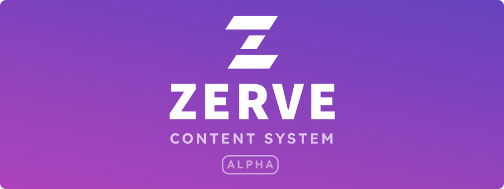

Today I’m excited to introduce a preview of the flagship Zerve Content System, a full-stack service that enables your non-technical team to manage JSON content and configuration in your app.

Your stores will define their own schema, (powered by [JSON-Schema](https://json-schema.org/)), which is used to create a custom GUI for data management, based on strict validation you define. Then Zerve generates a Typescript client for your codebase, which allows your app to safely access data in the content system.

You can use Zerve as a [headless CMS](https://docs.zerve.app/docs/intro#the-now-the-headless-content-management-system), but we are introducing components (such as [HumanText](https://docs.zerve.app/docs/zerve/human-text)) for use with React Native, which allow developers to quickly integrate flexible content in their apps.

## [Technical Workflow](https://docs.zerve.app/docs/get-started)

To integrate Zerve in your app, you:

1. Create a Store in the Zerve Service or your self-hosted instance
2. Add entries and schemas to your store with initial content
3. Install the CLI and Client to your codebase
4. Set the URL of the store inside your package.json
5. Run `zerve sync` to generate the client code which will be checked in to your codebase
6. Use the client in your React app, eg. `useMyData()`
7. Optionally install and use the content components in your React Native app
8. Deploy the app with your usual workflow

Now, invite your non-technical team to your Zerve organization, and they can safely modify content in your app according to the schema you have defined. Your app will query from the Content System to display the latest data.

Learn more about the [developer workflow here](https://docs.zerve.app/docs/get-started).

## Open Source

Zerve is [entirely Open Source](docs/about#open-source) under the liberal [Apache 2.0](https://github.com/zerve-app/zerve/blob/main/LICENSE.md) license.

You’re encouraged to self-host, fork the monorepo for your own projects, or utilize internal Zerve packages.

And of course, your contributions are very welcome!

## Hosted Content Service - Free Alpha

Zerve’s hosted offering will be a paid service. This is essential for validating product-market fit and ensuring the longevity of Zerve as a company.

To welcome early adopters, the alpha service will be entirely free while we iron out the kinks and make Zerve ready for production.

The [free alpha service](https://alpha.zerve.app) is available today for you to experiment with and use in your hobby apps, although it is not yet recommended for professional production applications. The service is freely available through Q1 2023.

Early next year, the paid service will launch, and we will notify you with at least 60 days notice to transition your app before the free service ends. Of course, you may download your data and self-host Zerve at any time.

## Roadmap

In the coming months Zerve will release a mobile app to the app stores, to make sure you always have access to your app content and config.

Although Zerve is [hyper-focused on being a robust and easy-to-use CMS for simple data like text and JSON](/docs/roadmap), the scope of the Content System will grow over time to support rich media like images and videos, and basic no-code features to help your team manage advanced content in your app. Over time we can support features for user-data such as authentication and near-real-time data.

Because Zerve is entirely Open Source, the internal building blocks will eventually be stabilized and documented, providing a full-stack framework for developers.

Eventually Zerve may grow into a complete no-code solution for real-world app development. Learn more about the [Zerve vision](/docs/vision) here.

## About

Zerve is a [lean startup](https://docs.zerve.app/docs/about#lean-startup) created by Eric Vicenti, a software developer with over a decade of experience in the industry.

Eric helped with the development and launch of popular open source projects including React Native, Docusaurus, and React Navigation.

## Get Involved

You can show your support for Zerve by starring the project on GitHub, following Zerve on twitter, and joining our discord channel.

I sincerely thank you for being a part of the Zerve community!

Eric Vicenti
